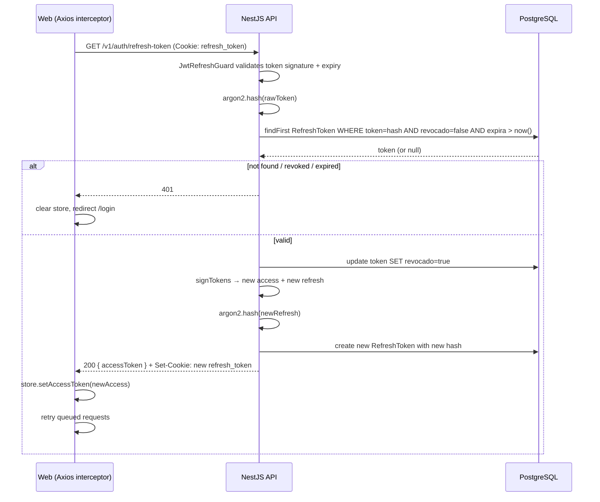
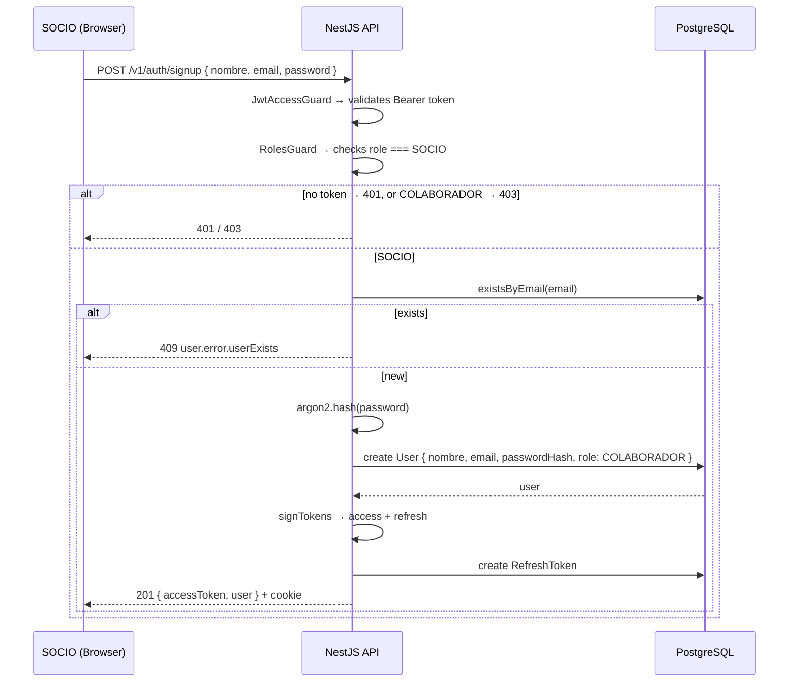

# Design: Auth & Login

## Technical Approach

Backend-first: Prisma schema → repository → service → controller → i18n. Then frontend: Axios → store → login page → interceptor → middleware. Single Prisma migration for enum + User + RefreshToken (Etapa 0, no production data to preserve).

## Architecture Decisions

| Decision | Options | Chosen | Rationale |
|---|---|---|---|
| PK type | UUID String (template) vs Int autoincrement (doc) | UUID String | Matches template, avoids cascade changes to guards/strategies that expect string userId. Exploration recommended this. |
| Soft-delete | `deletedAt` (template) vs `activo: false` (doc) | `activo: false` | Spec requirement. `UserRepository.softDelete()` sets `activo = false` instead of `deletedAt`. |
| Refresh transport | Authorization header vs httpOnly cookie | Both: accessToken in header (Zustand), refreshToken in httpOnly cookie | Spec requirement FE5. Cookie avoids XSS, header avoids CSRF for state-changing requests. |
| Cookie dev fallback | `Secure` flag requires HTTPS | Dev: omit `Secure`, Prod: `Secure; SameSite=Strict` | Localhost can't set Secure cookies. Env-based via `APP_ENV`. |
| `phone` naming | Keep `phone` (template) vs rename `telefono` (doc) | Keep `phone` | Minimizes diff; `@map("phone")` already snake_cased in DB. Doc's `telefono` is conceptual, not blocking. |
| `estudioId` type | `Int` (doc) vs `String` (if it were a relation) | `Int @default(1)` | Not a relation, just a tenant partition scalar. Follows doc. |

## Prisma Schema Diff

```diff
 enum Role {
-  ADMIN
-  MEMBER
-  DEVELOPER
+  SOCIO
+  COLABORADOR
 }

 model User {
   id             String    @id @default(uuid())
-  userName       String    @unique @map("user_name")
   email          String    @unique
   passwordHash   String    @map("password_hash")
-  firstName      String?   @map("first_name")
-  lastName       String?   @map("last_name")
-  isVerified     Boolean   @default(false) @map("is_verified")
+  nombre         String
   phone          String?
-  role           Role      @default(MEMBER)
+  role           Role      @default(COLABORADOR)
+  emoji          String?   @default("👤")
+  telegramChatId String?   @map("telegram_chat_id")
+  estudioId      Int       @default(1) @map("estudio_id")
+  googleTokens   Json?     @map("google_tokens")
+  activo         Boolean   @default(true)
   createdAt      DateTime  @default(now()) @map("created_at")
   updatedAt      DateTime  @updatedAt @map("updated_at")
-  deletedAt      DateTime? @map("deleted_at")
-  avatar         String?

+  refreshTokens  RefreshToken[]
+
   @@map("users")
 }

+model RefreshToken {
+  id        String   @id @default(uuid())
+  token     String   @unique
+  usuarioId String   @map("usuario_id")
+  expira    DateTime
+  revocado  Boolean  @default(false) @map("revocado")
+  creadoEn  DateTime @default(now()) @map("creado_en")
+
+  usuario   User     @relation(fields: [usuarioId], references: [id], onDelete: Cascade)
+
+  @@map("refresh_tokens")
+}
```

## Sequence Diagrams

### Login Flow

```mermaid
sequenceDiagram
    participant W as Web (Next.js)
    participant API as NestJS API
    participant DB as PostgreSQL

    W->>API: POST /v1/auth/login { email, password }
    API->>DB: findUnique user by email
    DB-->>API: user (or null)
    API->>API: argon2.verify(passwordHash, password)
    alt invalid
        API-->>W: 400 auth.error.invalidPassword
    else valid
        API->>API: signTokens(userId, role) → access(15m) + refresh(7d)
        API->>API: argon2.hash(refreshToken)
        API->>DB: create RefreshToken { token: hash, usuarioId, expira: now+7d }
        DB-->>API: ok
        API-->>W: 200 { accessToken, user } + Set-Cookie: refresh_token=<raw>; HttpOnly
        W->>W: Zustand store ← { user, accessToken }
        W->>W: redirect /dashboard
    end
```

### Refresh Rotation



### Signup by SOCIO



## Data Flow

```
┌──────────────────────────────────────────────────────────┐
│ Frontend (Next.js)                                       │
│                                                          │
│  middleware.ts ── checks refresh_token cookie            │
│       │                                                 │
│  AuthProvider ── on mount: refresh() → store.setUser()   │
│       │                                                 │
│  auth.store.ts (Zustand)                                 │
│    state: { user, accessToken }                          │
│    actions: login, logout, refresh, setUser              │
│       │                                                 │
│  axios-instance.ts                                       │
│    request interceptor: attach Bearer <accessToken>      │
│    response interceptor: on 401 → refresh → retry        │
│       │                                                 │
│  login/page.tsx                                          │
│    UserPicker → click user → password input → login()    │
└───────────┬──────────────────────────────────────────────┘
            │ /v1/auth/*   via Next.js proxy
┌───────────▼──────────────────────────────────────────────┐
│ Backend (NestJS)                                         │
│                                                          │
│  AuthPublicController                                    │
│    POST /v1/auth/login    @PublicRoute()                 │
│    POST /v1/auth/signup   JwtAccessGuard + RolesGuard    │
│    GET  /v1/auth/refresh  JwtRefreshGuard                │
│    POST /v1/auth/logout   JwtAccessGuard                 │
│    GET  /v1/auth/users    @PublicRoute()                 │
│       │                                                 │
│  AuthService                                             │
│    login() → verify → signTokens → persist RefreshToken  │
│    signup() → validate SOCIO → hash → create → tokens    │
│    refresh() → validate DB token → rotate → new tokens   │
│    logout() → revoke RefreshToken                        │
│    getActiveUsers() → findMany WHERE activo=true         │
│       │                                                 │
│  RefreshTokenRepository                                  │
│    create, findByToken, revoke, findByUsuarioNotRevoked  │
│       │                                                 │
│  UserRepository (modified: softDelete → activo=false)    │
└───────────┬──────────────────────────────────────────────┘
            │ Prisma
┌───────────▼──────────────────────────────────────────────┐
│ PostgreSQL                                               │
│   users + refresh_tokens                                 │
└──────────────────────────────────────────────────────────┘
```

## File Changes

### Backend

| File | Action | Description |
|---|---|---|
| `apps/api/prisma/schema.prisma` | Modify | Role enum + User fields + RefreshToken model |
| `apps/api/src/common/database/interfaces/user.interface.ts` | Modify | CreateUserInput: nombre, emoji?, estudioId; remove userName/firstName/lastName |
| `apps/api/src/common/database/interfaces/refresh-token.interface.ts` | Create | RefreshTokenEntity + CreateRefreshTokenInput |
| `apps/api/src/common/database/repositories/refresh-token.repository.ts` | Create | create, findByToken, revoke, findByUsuarioNotRevoked |
| `apps/api/src/common/database/repositories/user.repository.ts` | Modify | softDelete → `activo: false`; add findByActivo |
| `apps/api/src/common/database/database.module.ts` | Modify | Register + export RefreshTokenRepository |
| `apps/api/src/modules/auth/services/auth.service.ts` | Modify | login: persist refresh; signup: SOCIO-only + COLABORADOR default; NEW refresh (rotate); NEW logout (revoke) |
| `apps/api/src/modules/auth/auth.module.ts` | Modify | No structural changes (DatabaseModule covers new repo) |
| `apps/api/src/modules/auth/controllers/auth.public.controller.ts` | Modify | signup: remove @PublicRoute, add @AllowedRoles; NEW logout; NEW getActiveUsers |
| `apps/api/src/modules/auth/dtos/auth.signup.dto.ts` | Modify | Replace firstName/lastName with nombre |
| `apps/api/src/modules/auth/dtos/auth.response.dto.ts` | Modify | Use updated UserResponseDto |
| `apps/api/src/modules/user/dtos/user.dto.ts` | Modify | nombre, emoji, telefono, telegramChatId, estudioId, googleTokens, activo; remove old fields |
| `apps/api/src/modules/user/dtos/user.update.dto.ts` | Modify | Update fields to match new model |
| `apps/api/src/languages/en/auth.json` | Modify | Add logout, rotation, SOCIO-only signup keys |
| `apps/api/src/languages/en/user.json` | Modify | Update fields to new model |
| `apps/api/src/scripts/seeds/user.seed.ts` | Modify | Seed SOCIO user with emoji 👑 |

### Frontend

| File | Action | Description |
|---|---|---|
| `apps/web/package.json` | Modify | Add `axios` dependency |
| `apps/web/src/lib/auth/axios-instance.ts` | Create | Axios instance with request (Bearer inject) + response (401→refresh→retry) interceptors |
| `apps/web/src/features/auth/store/auth.types.ts` | Create | AuthState, AuthActions types |
| `apps/web/src/features/auth/store/auth.store.ts` | Create | Zustand: user, accessToken, isAuthenticated, login(), logout(), refresh(), setUser() |
| `apps/web/src/features/auth/api/types.ts` | Create | LoginPayload, SignupPayload, AuthResponse, ActiveUser |
| `apps/web/src/features/auth/api/service.ts` | Create | login, signup, refresh, logout, getActiveUsers API functions |
| `apps/web/src/features/auth/components/user-picker.tsx` | Create | Grid of active users: emoji + nombre, onClick → select |
| `apps/web/src/features/auth/components/login-form.tsx` | Create | Password input + submit for selected user |
| `apps/web/src/features/auth/components/login-page.tsx` | Create | Orchestrator: fetches users, manages picker + form state |
| `apps/web/src/app/login/page.tsx` | Create | Route that renders LoginPage |
| `apps/web/src/middleware.ts` | Create | Check refresh_token cookie → redirect to /login if missing; /login → /dashboard if present |
| `apps/web/src/components/layout/auth-provider.tsx` | Create | On mount: call refresh() to hydrate store; wraps children |
| `apps/web/src/components/layout/providers.tsx` | Modify | Wrap with AuthProvider |
| `apps/web/src/config/nav-config.ts` | Modify | Remove Clerk RBAC patterns; simplify for SOCIO/COLABORADOR |
| `apps/web/src/hooks/use-nav.ts` | Modify | Role-based filtering using auth store |

## Module Wiring (Backend)

```
AppModule
  ├── CommonModule
  │     └── DatabaseModule          ← NOW exports: UserRepository + RefreshTokenRepository
  │           ├── DatabaseService
  │           ├── UserRepository
  │           └── RefreshTokenRepository  (NEW)
  ├── AuthModule                     ← imports DatabaseModule
  │     ├── AuthPublicController     ← signup loses @PublicRoute, gains @AllowedRoles([SOCIO])
  │     ├── AuthService              ← injects RefreshTokenRepository
  │     ├── JwtAccessStrategy
  │     └── JwtRefreshStrategy
  └── UserModule                     ← unchanged wiring
```

## Migration Strategy

1. Single Prisma migration: enum rename + User column changes + RefreshToken table
2. **No data to preserve** (Etapa 0 dev). `prisma migrate dev` handles it.
3. Post-migration: `npm run db:generate` to rebuild Prisma client with new `UserRole.SOCIO | COLABORADOR`
4. Run seed: `npm run seed:admin` creates SOCIO user with emoji 👑
5. Runtime: `prisma migrate deploy` in production uses the generated SQL

**Rollback**: `prisma migrate reset` or `prisma migrate dev --create-only` → generate down migration manually, then `git checkout HEAD~1 -- apps/api/prisma/`

## Testing Strategy

| Layer | What to Test | Approach |
|---|---|---|
| Unit (BE) | AuthService: login, signup, refresh, logout with mocked repos | Jest, mock RefreshTokenRepository + UserRepository |
| Unit (BE) | RefreshTokenRepository: create, findByToken, revoke | Jest with mocked DatabaseService |
| Unit (BE) | Guards: RolesGuard with SOCIO/COLABORADOR | Jest, mock Reflector + ExecutionContext |
| Integration (BE) | Login → refresh → logout full cycle | Supertest e2e against test DB |
| Unit (FE) | Zustand store actions (login, logout, refresh) | Vitest (to be set up) |
| Integration (FE) | Login page: picker + form + redirect | Vitest + React Testing Library |
| Integration (FE) | Axios interceptor: 401 → refresh → retry | Vitest + MSW |

## Open Questions

- [ ] Should `GET /v1/auth/users` (active users for picker) be limited to SOCIO-only or remain public? Spec BE1-BE4 doesn't explicitly cover this. **Recommendation**: public (login page needs it), but return only `id, nombre, emoji` — no email, no phone.
